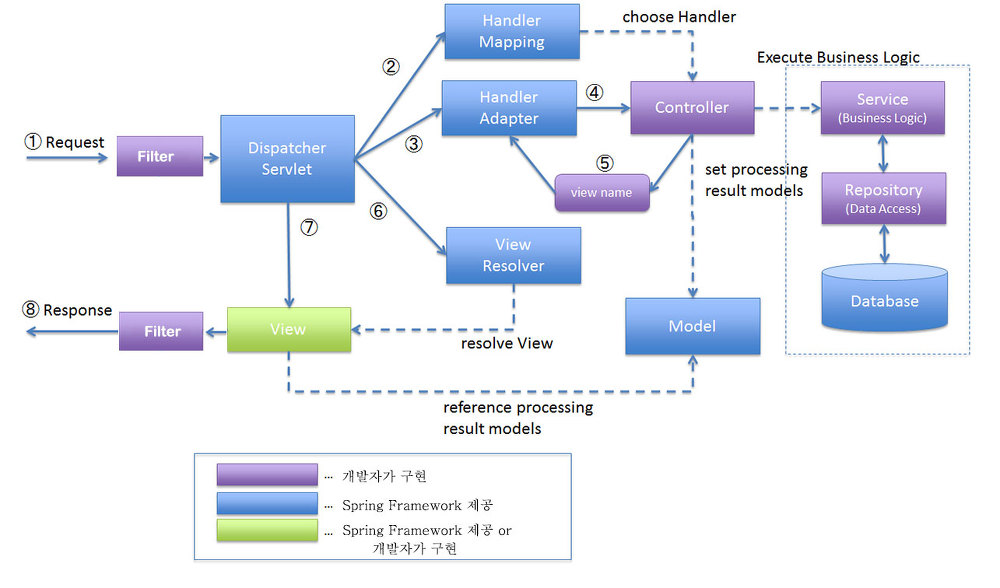

# 두 번째 용어정리
```
 Framework 	
 bean		
 DI(Dependency Injection(의존성주입)- IoC
 AOP(Aspect Oriented Programming(관점지향프로그래밍)
 POJO			
 proxy  or proxy 우회
 Validation			
 HandlerMapping
 Dispatcher Servlet		
 Spring MVC Life Cycle
 ContextLoaderListener	
 패턴매칭

 JoinPoint		
 Pointcut		
 Aspect		
 Advice		
 Weaving

 expression	
 Annotation	
 Repository	
 트랜잭션

 전자정부표준 프레임워크(egov)		
 Maven : 프로젝트 관리 도구 

 아키텍처(architecture)
```
## Framework
- 프로그래밍에서 특정 운영체제를 위한 응용 프로그램 표준 구조를 구현하는 클래스와 라이브러리 모임
- 목적에 따라 효율적으로 구조를 짜놓는 개발 방식
- 하나의 애플리케이션을 구축할 때, 모든 애플리케이션의 공통적인 개발환경을 제공, 개발에 필요한 화면구현, DB연동, 개발환경들에 공통적인 부분을 제공함으로써 개발 시간과 리소스 비용을 절감해 생산성을 높여주는 것

## Bean
- spring container에서 생성되는 객체
- spring ioc container가 관리하는 자바 객체, spring bean container에 존재하는 객체, spring ioc(Inversion pf control) container에 의해 인스턴스화, 관리, 생성된다.
Bean Container는 의존성 주입을 통해 bean 객체를 사용할 수 있도록 도움, spring에서 b보통 singleton으로 존재

## DI(Dependency Injection(의존성 주입)) - IoC
- DI(Dependency Injection): 스프링이 다른 프레임워크와 차별화되어 제공하는 의존 관계 주입 기능으로, 객체를 직접 생성하는게 아니라 외부에서 생성한 후 주입 시켜주는 방식, DI를 통해서 모듈간의 결합도가 낮아지고 유연성이 높아짐
- IoC(Inversion of Control): "제어의 역전"이라는 의미, 메소드나 객체의 호출 작업을 개발자가 결정하는 것이 아니라, 외부에서 결정되는 것을 의미
- IoC는 제어의 역전이라고 말하며, 간단히 말해 "제어의 흐름을 바꾼다'라고 한다. 객체의 의존성을 역전시켜 객체 간의 결합도를 줄이고 유연한 코드를 작성할 수 있게 하여 가독성 및 코드 중복, 유지 보수를 편하게 할 수 있다.

## AOP(Aspect Oriented Programming): 관점 지향 프로그래밍
- AOP는 관점 지향 프로그래밍, 어떤 로직을 기준으로 핵심적인 관점, 부가적인 관점으로 나누어서 보고 그 관점을 기준으로 각각 모듈화하겠다는것
- 모듈화: 어떤 공통된 로직이나 기능을 하나의 단위로 묶는 것
- AOP 주요 개념
    - Aspect: 흩어진 관심사를 모듈화 한 것, 주로 부가 기능을 모듈화
    - Target: Aspect를 적용하는 곳 (클래스, 메서드)
    - Advice: 실질적으로 어떤 일을 해야할 지에 대한것, 실질적인 부가기능을 담은 구현체
    - JointPoint: Advice가 적용될 위치, 끼어 들 수 있는 지점, 메서드 진입 지점, 생성자 호출 시점, 필드에서 값을 꺼내올 때 등 다양한 시점에 적용 가능
    - PointCut: JointPoint의 상세한 스텍을 정의 한 것, 'A'란 메서드의 진입 시점에 호출할 것 과 같이 더욱 구체적으로 Advice가 실행될 지점을 정할 수 있음

## POJO
- 특정 기술규약과 환경에 종속되지 않은 오브젝트
- 토비의 스프링에서는 진정한 POJO란 객체지향적인 원리에 충실하면서, 환경과 기술에 종속되지 않고 필요에 따라 재활용될 수 있는 방식으로 설계된 오브젝트

## Proxy or Proxy 우회
- Proxy: 타켓을 감써서 요청을 대신 받아주는 랩핑 클래스, 스프링에서는 Proxy를 이용해 객체 지향의 5대원칙 중 하나인 OCP(Open-Close Principal: 개방 폐쇄의 원칙)를 적용

## Validation
- 객체의 유효성 검증을 위해 스프링 프레임워크는 `org.springframework.validation.Validator`라는 인터페이스를 제공, Validator는 특정 계층에 종속적인 구조가 아니라서, Web이나 data-access 등 어떤 계층의 객체라도 유효성 검증이 가능하게 한다.

## HandleMappding
- dispatcherServlet으로 받은 요청은 Controller로 보내지는데, 그런 요청이 어떤 룰으로 컨트롤러에게 보내지는지(매핑하는지), 그 방법을 정해주는 클래스가 `Handler`

## Dispatcher Servlet
- dispatch는 보내다라는 뜻으로, 디스패처 서블릿은 가장 앞단에서 HTTP 프로토콜로 들어오는 모든 요청을 가장 먼저 받아 적합한 컨트롤러에 위임해주는 프론트 컨트롤러라고 정의
- Front Controller: 서블릿 컨테이너의 제일 앞에서 서버로 들어오는 클라이언트의 모든 요청을 받아서 처리해주는 컨트롤러, MVC구조에서 함께 사용되는 디자인.

## Spring MVC Life Cycle


- filter
    - filter: web app의 전역적인 로직을 담당
    - filter라는 단어 뜻에서 알 수 있듯이, 전체적인 필터링(설정)을 하는 곳
    - dispatcherservlet에 들어가기 전인 web app 단에서 실행
- dispatcherservlet
    - 들어오는 모든 request를 우선적으로 받아 처리해주는 서블릿
    - handlermapping에게 request에 대해 매핑할 controller 검색을 요청
    - dispatcher라는 단어가 '배치 담당자'라는 뜻이 있듯이, 말 그래도 request에 대해 어느 컨트롤러를 매핑시킬 것인지 배치하는 역할
- handlermapping
    - dispatcherservlet으로부터 검색을 요청받은 controller를 찾아 정보를 리턴
- handlerinterceptor
    - request가 controller에 매핑되기 전 앞단에서 부가적인 로직을 끼워 넣는다.
    - 주로 세션, 쿠키, 권한 인증 로직에 많이 사용
- controller
    - request가 매핑되는 곳
    - request에 대해 어떤 로직으로 처리할 것인지를 결정하고, 그에 맞는 service를 호출
    - service bean을 스프링 컨테이너로부터 주입, service bean의 메소드를 호출
- service
    - 데이터 처리 및 가공을 위한 비즈니스 로직을 수행
    - request에 대한 실질적인 로직을 수행하기 때문에 spring mvc lifecycle의 심장이라 불리며 service가 없다면 서버 애플리케이션의 존재 이유가 없다.
    - repository를 통해 db에 접근하여 데이터의 CRUD(create, read, update, delete)를 처리
- respository
    - db에 접근하는 객체, dao(data access object)
    - service에서 db에 접근할 수 있게 하여 데이터의 crud를 할 수 있게 해준다.
- viewresolver
    - controller에서 리턴한 view의 이름을 dispatcherservlet으로부터 넘겨 받고, 해당 view를 렌더링
    - 렌더링한 view는 dispatcherservlet으로 리턴하고, dispatcherservlet에서는 view 화면을 response한다.

- contextloaderlistener
    - spring에서 dispatcherservlet은 그 자체로서 서블릿이기 때문에 1개 이상의 dispatcher servlet을 설정하는 것이 가능
    - web.xml에서 두개의 독립적으로 작동하는 dispatcherservlet을 생성한 경우, 두 dispatcherservlet은 각각 별도으이 webapplicationContext를 생성
    - 두 controller에서 동시에 필요한 의존성(공통 빈)이 있어야 하는 경우, contextloadlistener를 사용하여 공통으로 사용된 빈을 설정
- 패턴 매칭
    - aspectJ에서 사용되는 표현식
    - set*(...): set으로 시작하는 모든 메서드
    - * main(..): 리턴 타입 상관없이 이름이 main인 모든 메서드
 - weaving
    - aspect가 지정된 객체를 새로운 프록시 객체를 생성하는 과정
    - aop weaving의 종류
        - run-time weaving: spring aop에서 사용하는 weaving 방식, 스프링에서는 run-time weaving을 통해 CGLIB proxy 혹은 JDK Dynamic Proxy를 생성
        - load-time weaving: spring aop가 아닌 aspectj 라이브러리를 추가하여 사용, 객체를 load할 때, aspectj에 의해서 weaving된 객체를 넘겨주는 방식, applicationcontext에 로드된 객체들을 불러온 뒤, aspectj weaver에 의해 객체들을 weaving한다, 객체들을 불러온 뒤 weaving을 하기 때문에 약간의 퍼포먼스 하락이 있음
        - compile-time weaving: spring aop가 아닌 aspectj 라이브러리를 추가하여 사용, compile시에 aspectj에서 필요한 객체 weaving을 통해 클래스를 생성하는 방식, load-time에 대한 정차가 없어서 퍼포먼스 하락 없이 구성이 가능, lombok과 같이 compile시 간섭하는 plugin들과 충돌이 발생

- expression
    el(Expression Language)
        - el 구문은 ${..}내에 표현식으로 표현

- annotation
    - @를 이용한 주석, 자바 코드에 주석을 달아 특별한 의미를 부여한 것
    - 컴파일러가 특정 오류를 억제하도록 지시하는 것과 같이 프로그램 코드의 일부가 아닌 프로그램에 관한 데이터를 제공, 코드에 정보를 추가하는 정형화된 방법

- repository
    - entity에 의해 성성된 db에 접근하는 메서드들을 사용하기 위한 인터페이스, 어떤 값을 넣거나, 넣어진 값을 조회하는 등의 crud를 어떻게 할 것인지 정의해주는 계층
    - jpa를 주로 사용

- 트랜잭션
    - 여러과정을 하나의 행위로 묶을 때 사용, 여러 단계를 수행했을 때, 하나라도 실패하면 모둔 취소되어야 한다. 이렇게 함으로써 데이터의 무결성을 보장한다. 모두 반영하거나 반영하지 않음

- 전자정부표준프레임워크(egov)
    - 공공사업에 적용되는 개발 프레임워크의 표준 정립으로 응용 SW 표준화, 품질 및 재사용성 향상을 목표, 이를 통해 "전자정부 서비스의 품질향상" 및 "정보화 투자 효율성을 향상"을 달성하고, 중, 대기업이 동일한 개발 기반 위에서 공정경쟁이 가능

- maven: 프로젝트 관리 도구
    - 필요한 라이브러리를 특정 문서(pom.xml)에 정의해 놓으면 네트워크를 통해서 라이브러리들을 자동으로 다운받아주는 프로젝트 관리 도구
    - maven의 장점
        - 라이브러리의 관리를매우 용이하게 해준다.
        - 프로젝트 작성부터 컴파일 등 프로젝트 라이프사이클에 포함되는 각 테스트를 지원
        - war 파일 기반의 배포용으로도 자주 사용

- 아키텍처
    - spring mvc architecture
        - 사용자의 요청을 처리하고 다시 사용자에게 반환하는 과정을 3가지 역할(Model, View, Controller)로 구분해서 처리하는 개발 방법을 의미